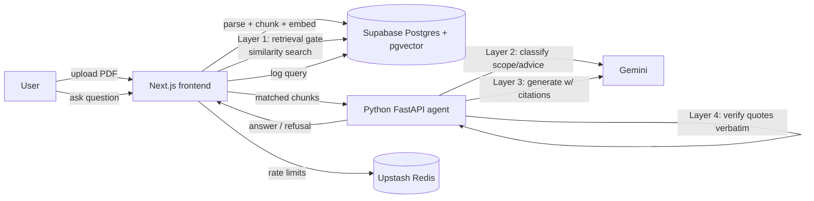

# LedgerLock

LedgerLock is a single-document financial Q&A tool that answers questions **only** from an
uploaded PDF, cites the exact page/snippet backing every answer, and refuses (with a logged
reason) anything it can't support from the document — including investment-advice requests.

## Problem statement

Financial documents (10-Ks, prospectuses, statements) are long and dense. Generic LLM chat
tools will confidently answer questions the source document doesn't support, or worse, offer
advice they aren't qualified to give. LedgerLock constrains the model to the uploaded document
via a 4-layer guardrail pipeline and makes every refusal visible in an audit trail, so the tool
is trustworthy for a compliance-sensitive domain.

## Architecture



- **Frontend** (`frontend/`) — Next.js 16 (App Router, Turbopack), React 19, Tailwind v4,
  shadcn/ui (Base UI primitives). Handles auth, document upload/list, chat UI, audit log, and
  orchestrates the guardrail pipeline's Layer 1 (retrieval gate) before calling the agent.
- **Agent** (`agent/`) — Python FastAPI microservice implementing Layers 2–4: scope/advice
  classification, cited answer generation, and verbatim-quote verification against the chunks
  that were actually retrieved (prevents citing content the model wasn't given).
- **Database** (`supabase/migrations/0001_init.sql`) — Postgres + pgvector on Supabase.
  `documents`, `document_chunks` (vector(1536), HNSW cosine index), `queries` (audit log), all
  with row-level security scoped to `auth.uid()`. Private Storage bucket `documents` for PDFs.
- **Rate limiting** — Upstash Redis sliding-window limiters per user for uploads, reads,
  deletes, queries, and audit-log reads.

### The 4-layer guardrail pipeline

1. **Retrieval gate** (frontend): embed the question, run `match_document_chunks` RPC; if
   nothing clears the similarity threshold, refuse `refused_out_of_scope` without ever calling
   the LLM.
2. **Classifier** (agent): fail-closed check — is this an advice/recommendation/prediction
   request? If so, refuse `refused_advice_request`.
3. **Generator** (agent): answer strictly from the retrieved chunks, with page-number + verbatim
   quote citations, or return `insufficient_context`.
4. **Verifier** (agent): every citation's quote must appear verbatim (case-insensitive) in a
   chunk that was actually retrieved. Any citation that fails this check causes the whole
   response to be discarded and re-classified as `insufficient_context`.

## Repository layout

```
LedgerLock/
  frontend/           Next.js app (deployed to Vercel)
  agent/              FastAPI guardrail agent (deployed to Render or similar)
  supabase/migrations/0001_init.sql   DB schema, RLS policies, RPC
  LedgerLock/*.md     Product docs: information.md, milestone.md, plan.md, prd.md, trd.md
```

## Local setup

### Prerequisites
- Node.js 20+
- Python 3.12+ (**not installed in the environment this project was built in** — the agent's
  code has not been run or pytest-verified locally; see [Known limitations](#known-limitations))
- A Supabase project (Postgres + pgvector + Storage)
- An Upstash Redis database
- A Google Gemini API key

### 1. Database
Apply the migration to your Supabase project (SQL editor or `supabase db push`):
```
supabase/migrations/0001_init.sql
```
This creates the schema, RLS policies, the `match_document_chunks` RPC, and the private
`documents` storage bucket.

### 2. Agent
```
cd agent
python -m venv .venv
.venv\Scripts\activate
pip install -r requirements.txt
copy .env.example .env   # fill in GEMINI_API_KEY, AGENT_API_KEY
uvicorn main:app --reload --port 8000
pytest                    # verify the guardrail logic
```

### 3. Frontend
```
cd frontend
npm install
copy .env.example .env.local   # fill in Supabase, Upstash, agent URL/key
npm run dev
```
Visit `http://localhost:3000`.

### Build/lint validation
```
cd frontend
npm run build
npx eslint .
```
Both currently pass with zero errors/warnings (verified in this environment; Upstash "missing
config" console warnings during build are expected without real env vars and are non-fatal).

## Known limitations

- **Python is not installed in the environment this project was built in.** The `agent/` code
  was written to match `trd.md`/`plan.md` exactly (fail-closed classifier, verbatim citation
  verification, token-bucket rate limiting) and has unit tests in `agent/tests/`, but neither
  `pip install` nor `pytest` has been run. **You must install Python 3.12+ and run
  `pytest` inside `agent/` before trusting the agent in production.**
- **No live cloud credentials were available in this environment.** The upload → parse → chunk
  → embed → query pipeline has been validated only via static analysis (`next build`, ESLint) —
  not an end-to-end run against real Supabase/Upstash/Gemini services. Test this locally with
  your own credentials before deploying.
- `npm audit` reports 2 moderate-severity advisories from a `postcss` version bundled
  *inside* Next.js's own `node_modules/next/node_modules/postcss` (CSS stringify XSS). The only
  automated fix path (`npm audit fix --force`) downgrades Next.js to a `9.x` canary, which is a
  severe regression — not applied. This is a build-tool-only dependency (not shipped to the
  browser at runtime), so risk is low; re-check when Next.js publishes a patched release.

## Deployment

- **Frontend** → Vercel (Next.js first-class support). Set env vars from `frontend/.env.example`.
- **Agent** → Render (or any container host). Set env vars from `agent/.env.example`.
- **Database** → Supabase (hosted). Apply `supabase/migrations/0001_init.sql`.
- **Rate limiting** → Upstash Redis (hosted, serverless-friendly).

None of the above have been provisioned/deployed in this session — you'll need your own
accounts and credentials to deploy.
